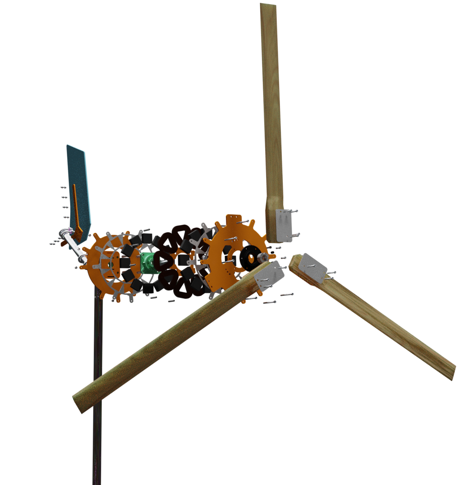
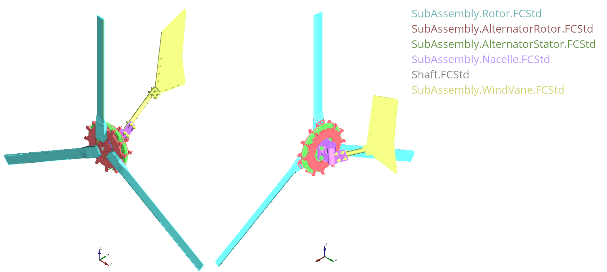
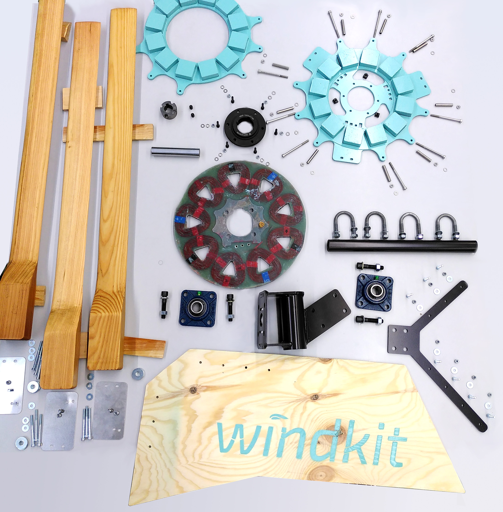
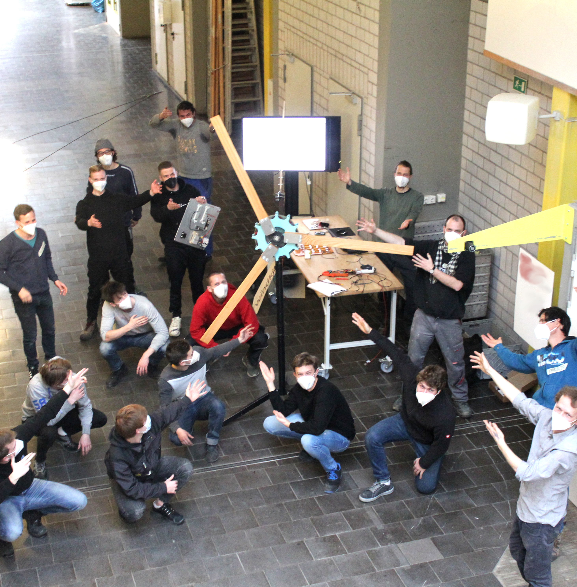

  

  #### ⚠️ Caution: The windkit is still in development.Prototype not field tested yet!⚠️
  #### ⚠️ Project is not recommended for reproduction!⚠️
  
  

___
  

### Introduction:
The windkit is a small wind turbine to generate electricity from wind energy. It can be used either in offgrid or ongrid applications. Apart from the [aluminium and steel parts](https://gitlab.opensourceecology.de/verein/projekte/cab/windkit/-/tree/review/Export/LaserCutterFiles) that need to be laser cutted the windkit can be build and maintained using standard hand tools.

### Main features:

- **secure**
- **easy to build, repair & maintain**
- **open-source**

### Technical specifications:

- **rotor diameter 2.0 Meter**
- **rated power 400 Watt**
- **an. power production 500 kWh/a @ 4 m/s**
- **system voltage 12, 24, 48 Volt**

For more information check out the [Flyer](./Misc/FlyerWindkit.pdf)!

## Software requirements
windkit is build with realthunder's FreeCAD fork : FreeCAD_assembly3 [2020.08.18](https://github.com/realthunder/FreeCAD_assembly3/releases/tag/0.11). To modify the model we recommend the same or even newer versions. For the assembly process we've been using the assembly workbench Assembly3. The workbench is bundled in the fork mentioned before, no addition installation are needed. In addition we use the Fasteners WB [V0.3.32 03 Sep 2020](https://github.com/shaise/FreeCAD_FastenersWB/tree/bbdcf82e55467523f5533179a896225213b0b5f1) for fasteners groups, this workbench needs to be installed separatly via the Addon-Manager in Freecad. 

## Assembly overview
The master assembly file is called `MainAssembly.windkit.FCStd`. All sub-assemblies are saved in different folders. The sub-assemblies are shown in the following image below. The [BOM](./Bom.ods) is also structured the way the Cad is organised.

## Prototype

Beginning of 2021 a prototype has been built in a workshop.
The following picture shows all parts of the windkit prototype before assembly. 

  
  

The next step is to bring the turbine to the field for testing!

## Get in touch with us

You wanna know more about this project or drink a beer with us? Just write us a message info@deltaempower.org

windkit is developed by deltaEmpower
