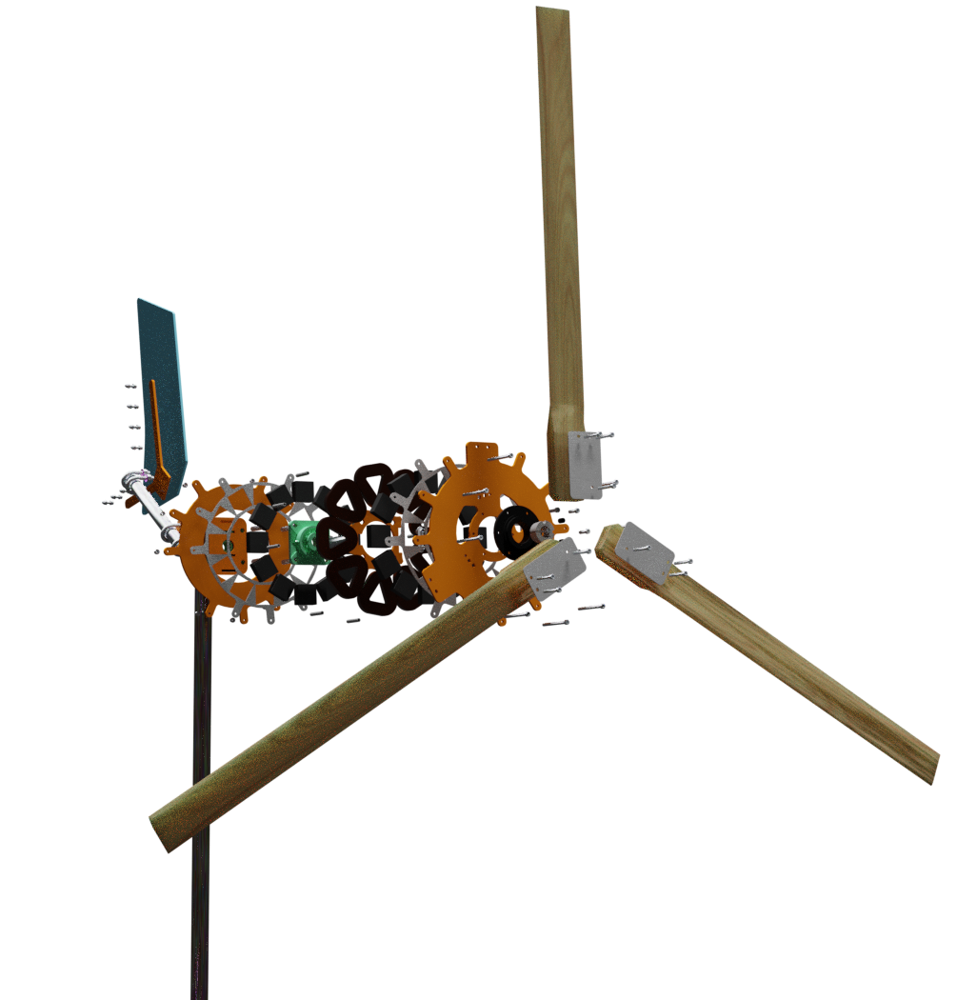
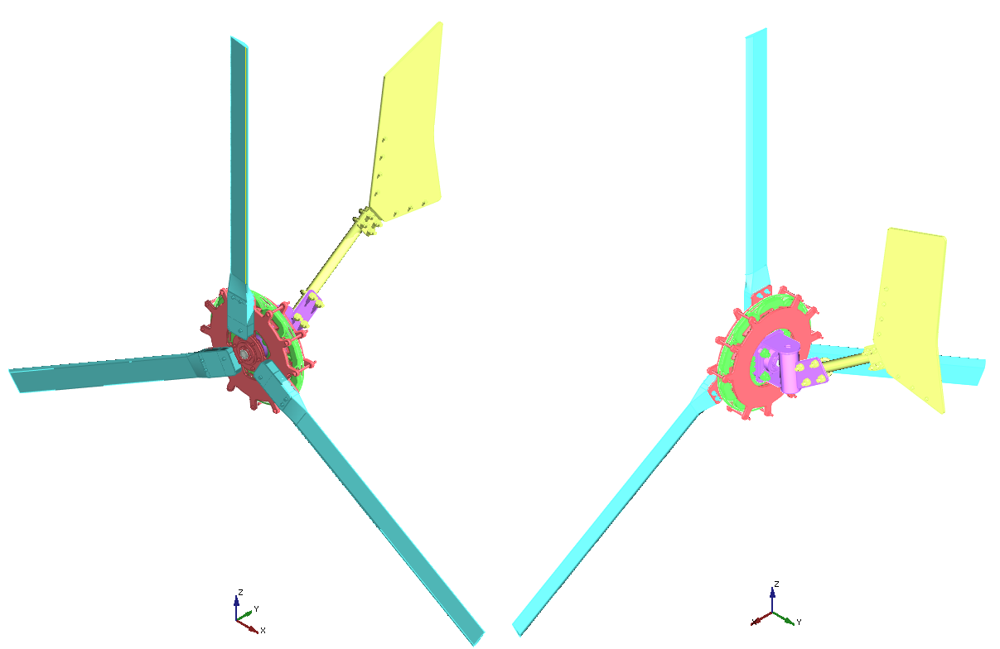
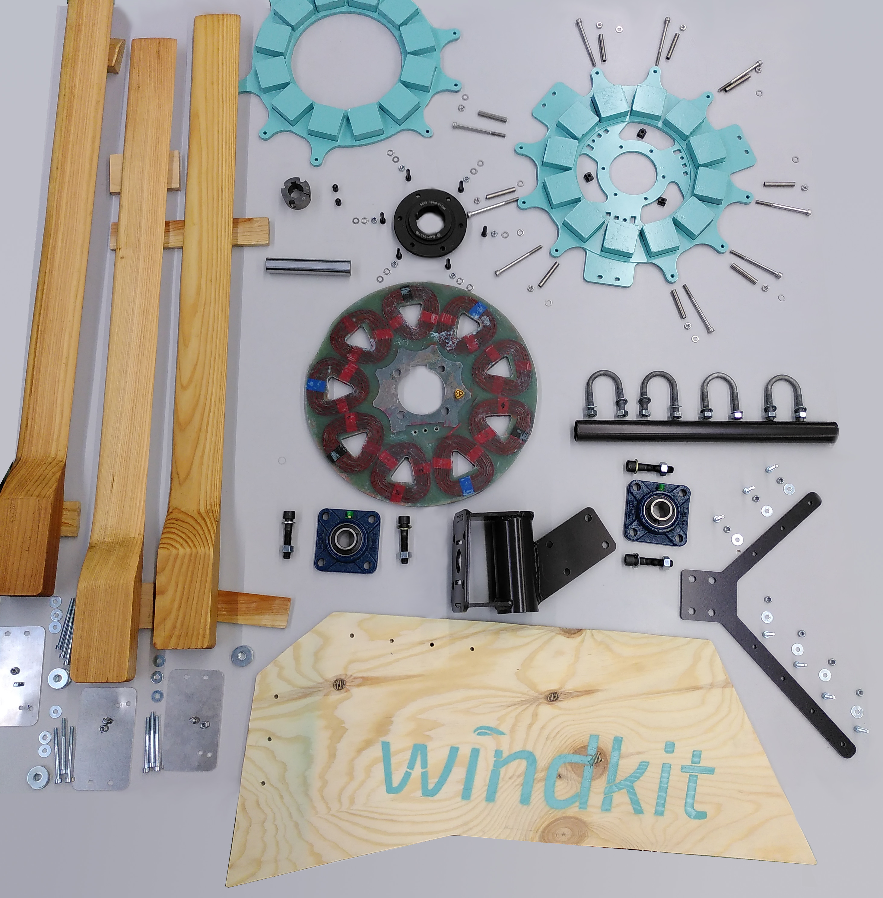

  

  #### ⚠️ Caution: The windkit is still in development. Prototype not field tested yet!⚠️ 

___
  

### Main features:

### Technical specifications:

- **rotor diameter 2.0 Meter**
- **rated power 400 Watt**
- **an. power production 500 kWh/a @ 4 m/s**
- **system voltage 12, 24, 48 Volt**

___

## software requirements

## AssemblyOverview

  
